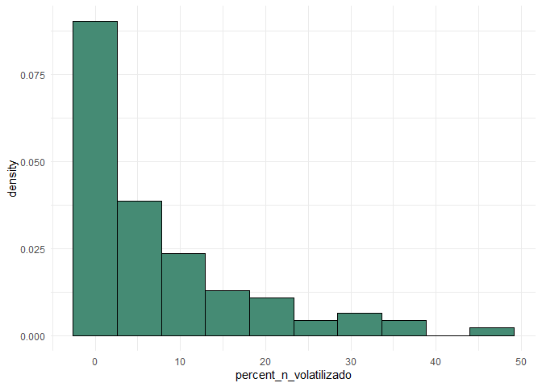
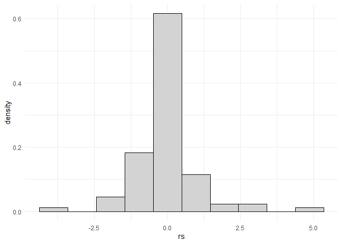
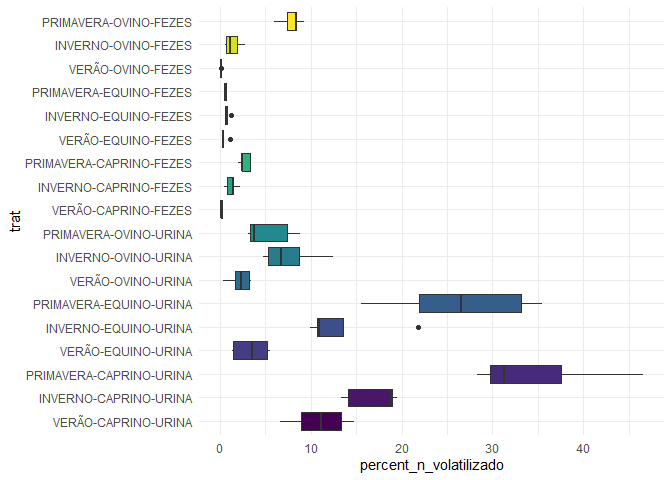
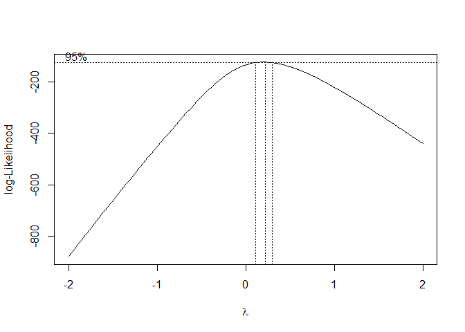
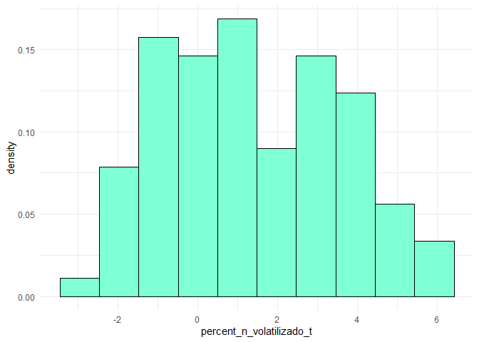
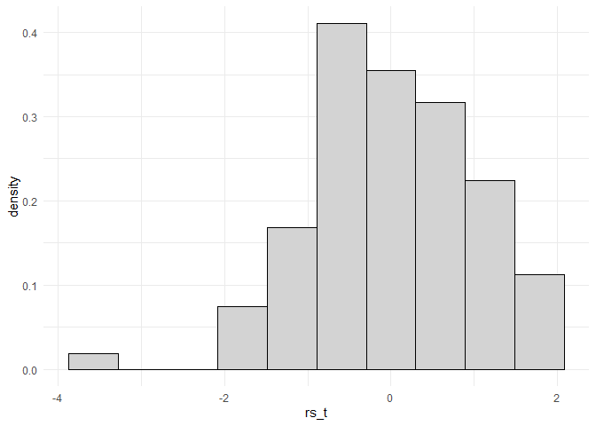
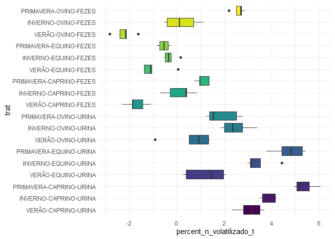

<!-- README.md is generated from README.Rmd. Please edit that file -->

# Análise de volatilização de amônia por excretas animal

## Carregando Pacotes

``` r
library(tidyverse)
library(agricolae)
library(emmeans)
library(readxl)
library(skimr)
library(MASS)
library(lme4)
```

## Entrada de dados

``` r
dados <- read_xlsx("data/DADOS GILMAR VOL NH3.xlsx") %>% 
  janitor::clean_names() %>% 
  mutate_at(vars(estacao, especie, excreta, rp), as_factor)
glimpse(dados)
#> Rows: 90
#> Columns: 11
#> $ tratamento             <chr> "Urina de Caprino", "Urina de Caprino", "Urina ~
#> $ estacao                <fct> VERÃO, VERÃO, VERÃO, VERÃO, VERÃO, VERÃO, VERÃO~
#> $ especie                <fct> CAPRINO, CAPRINO, CAPRINO, CAPRINO, CAPRINO, EQ~
#> $ excreta                <fct> URINA, URINA, URINA, URINA, URINA, URINA, URINA~
#> $ rp                     <fct> 1, 2, 3, 4, 5, 1, 2, 3, 4, 5, 1, 2, 3, 4, 5, 1,~
#> $ tr                     <dbl> 2, 2, 2, 2, 2, 4, 4, 4, 4, 4, 6, 6, 6, 6, 6, 1,~
#> $ especie_2              <dbl> 1, 1, 1, 1, 1, 2, 2, 2, 2, 2, 3, 3, 3, 3, 3, 1,~
#> $ excreta_2              <dbl> 1, 1, 1, 1, 1, 1, 1, 1, 1, 1, 1, 1, 1, 1, 1, 2,~
#> $ estacao_2              <dbl> 1, 1, 1, 1, 1, 1, 1, 1, 1, 1, 1, 1, 1, 1, 1, 1,~
#> $ bloco                  <dbl> 1, 2, 3, 4, 5, 1, 2, 3, 4, 5, 1, 2, 3, 4, 5, 1,~
#> $ percent_n_volatilizado <dbl> 13.31456414, 14.72593502, 11.09723583, 6.643591~
```

## Resumo simples dos dados

``` r
skim(dados)
```

|                                                  |       |
|:-------------------------------------------------|:------|
| Name                                             | dados |
| Number of rows                                   | 90    |
| Number of columns                                | 11    |
| \_\_\_\_\_\_\_\_\_\_\_\_\_\_\_\_\_\_\_\_\_\_\_   |       |
| Column type frequency:                           |       |
| character                                        | 1     |
| factor                                           | 4     |
| numeric                                          | 6     |
| \_\_\_\_\_\_\_\_\_\_\_\_\_\_\_\_\_\_\_\_\_\_\_\_ |       |
| Group variables                                  | None  |

Data summary

**Variable type: character**

| skim_variable | n_missing | complete_rate | min | max | empty | n_unique | whitespace |
|:--------------|----------:|--------------:|----:|----:|------:|---------:|-----------:|
| tratamento    |         0 |             1 |  14 |  16 |     0 |        6 |          0 |

**Variable type: factor**

| skim_variable | n_missing | complete_rate | ordered | n_unique | top_counts                 |
|:--------------|----------:|--------------:|:--------|---------:|:---------------------------|
| estacao       |         0 |             1 | FALSE   |        3 | VER: 30, INV: 30, PRI: 30  |
| especie       |         0 |             1 | FALSE   |        3 | CAP: 30, EQU: 30, OVI: 30  |
| excreta       |         0 |             1 | FALSE   |        2 | URI: 45, FEZ: 45           |
| rp            |         0 |             1 | FALSE   |        5 | 1: 18, 2: 18, 3: 18, 4: 18 |

**Variable type: numeric**

| skim_variable           | n_missing | complete_rate | mean |    sd |   p0 |  p25 |  p50 |   p75 |  p100 | hist  |
|:------------------------|----------:|--------------:|-----:|------:|-----:|-----:|-----:|------:|------:|:------|
| tr                      |         0 |             1 | 3.50 |  1.72 | 1.00 | 2.00 | 3.50 |  5.00 |  6.00 | ▇▃▃▃▃ |
| especie_2               |         0 |             1 | 2.00 |  0.82 | 1.00 | 1.00 | 2.00 |  3.00 |  3.00 | ▇▁▇▁▇ |
| excreta_2               |         0 |             1 | 1.50 |  0.50 | 1.00 | 1.00 | 1.50 |  2.00 |  2.00 | ▇▁▁▁▇ |
| estacao_2               |         0 |             1 | 2.00 |  0.82 | 1.00 | 1.00 | 2.00 |  3.00 |  3.00 | ▇▁▇▁▇ |
| bloco                   |         0 |             1 | 3.00 |  1.42 | 1.00 | 2.00 | 3.00 |  4.00 |  5.00 | ▇▇▇▇▇ |
| percent_n\_volatilizado |         0 |             1 | 7.55 | 10.03 | 0.01 | 0.66 | 3.24 | 10.44 | 46.59 | ▇▁▁▁▁ |

## Explorando a variável resposta

``` r
dados %>% 
  ggplot(aes(x=percent_n_volatilizado, y = ..density..)) +
  geom_histogram(bins = 10, color="black", fill="aquamarine4")+
  theme_minimal()
```

<!-- -->

## Testando os pressupostos

``` r
dados <- dados %>% 
  mutate(
    trat = interaction(estacao, especie, excreta,sep="-"))
```

## Anova Preliminar

``` r
mod0 <- aov(percent_n_volatilizado ~ trat, data =dados)
summary(mod0)
#>             Df Sum Sq Mean Sq F value Pr(>F)    
#> trat        17   8190   481.8   44.98 <2e-16 ***
#> Residuals   72    771    10.7                   
#> ---
#> Signif. codes:  0 '***' 0.001 '**' 0.01 '*' 0.05 '.' 0.1 ' ' 1

dados %>% 
  mutate(
    pred = predict(mod0),
    rs = rstudent(mod0)
  ) %>% 
  ggplot(aes(x=rs, y= ..density..)) +
  geom_histogram(bins = 10, color="black", fill="lightgray")+
  theme_minimal()
```

<!-- --> teste de
normalidade de **Shapiro-Wilk**

``` r
mod0 %>% rstudent() %>% shapiro.test()
#> 
#>  Shapiro-Wilk normality test
#> 
#> data:  .
#> W = 0.83627, p-value = 1.427e-08
```

``` r
dados %>% 
  ggplot(aes(x=trat, y= percent_n_volatilizado,fill=trat)) +
  geom_boxplot()+
  theme_minimal() +
  coord_flip() +
  theme(legend.position = "none") +
  scale_fill_viridis_d()
```

<!-- -->

> Existe uma discrepância nos valores de `percent_n_volatilizado` entre
> urina e fezes, levando a heterocedasticidade.

### Possiveis Soluções popostas:

-   1)  Aplicar uma transformação nos dados para trazer todos a uma
        mesma escala.

``` r
BoxCox <- (boxcox(mod0))
```

<!-- --> Encontrando
o valor de
.

``` r
lambda <- BoxCox %>% 
  data.frame() %>% 
  arrange(desc(y)) %>% 
  slice(n=1) %>% 
  pull(x)
lambda
#> [1] 0.2222222
```

como

e

usamos a transformação de dados:


``` r
dados <- dados %>% 
  mutate(
    percent_n_volatilizado_t = (percent_n_volatilizado^lambda-1)/(lambda)
    )
```

Vamos refazer as análises, portanto.

``` r
dados %>% 
  ggplot(aes(x=percent_n_volatilizado_t, y = ..density..)) +
  geom_histogram(bins = 10, color="black", fill="aquamarine1")+
  theme_minimal()
```

<!-- -->

``` r
mod1 <- aov(percent_n_volatilizado_t ~ trat, data =dados)
dados %>% 
  mutate(
    pred_t = predict(mod1),
    rs_t = rstudent(mod1)
  ) %>% 
  ggplot(aes(x=rs_t, y= ..density..)) +
  geom_histogram(bins = 10, color="black", fill="lightgray")+
  theme_minimal()
```

<!-- -->

teste de normalidade de **Shapiro-Wilk**

``` r
mod1 %>% rstudent() %>% shapiro.test()
#> 
#>  Shapiro-Wilk normality test
#> 
#> data:  .
#> W = 0.98417, p-value = 0.3456
```

``` r
dados %>% 
  ggplot(aes(x=trat, y= percent_n_volatilizado_t,fill=trat)) +
  geom_boxplot()+
  theme_minimal() +
  coord_flip() +
  theme(legend.position = "none") +
  scale_fill_viridis_d()
```

<!-- -->

## Análise de variância PRIMAVERA

``` r
mod4 <- lm(percent_n_volatilizado_t ~ excreta * especie,
  data= dados %>% filter(estacao == "PRIMAVERA")
)
anova(mod4)
#> Analysis of Variance Table
#> 
#> Response: percent_n_volatilizado_t
#>                 Df Sum Sq Mean Sq F value    Pr(>F)    
#> excreta          1 65.617  65.617 288.939 6.923e-15 ***
#> especie          2  7.427   3.714  16.353 3.304e-05 ***
#> excreta:especie  2 51.741  25.870 113.918 5.612e-13 ***
#> Residuals       24  5.450   0.227                      
#> ---
#> Signif. codes:  0 '***' 0.001 '**' 0.01 '*' 0.05 '.' 0.1 ' ' 1
```

## Comparação de médias

``` r
dados %>% filter(estacao == "PRIMAVERA") %>% 
  group_by(excreta, especie) %>% 
  summarise(
    y= mean(percent_n_volatilizado),
    y_t= mean(percent_n_volatilizado_t)
  )
#> # A tibble: 6 x 4
#> # Groups:   excreta [2]
#>   excreta especie      y    y_t
#>   <fct>   <fct>    <dbl>  <dbl>
#> 1 URINA   CAPRINO 34.7    5.37 
#> 2 URINA   EQUINO  26.5    4.75 
#> 3 URINA   OVINO    5.24   1.89 
#> 4 FEZES   CAPRINO  2.68   1.08 
#> 5 FEZES   EQUINO   0.572 -0.547
#> 6 FEZES   OVINO    7.87   2.60
```

``` r
post_hoc_ExEs <- emmeans(mod4, ~ excreta*especie)
pairs(post_hoc_ExEs, adjust="tukey")
#>  contrast                      estimate    SE df t.ratio p.value
#>  URINA CAPRINO - FEZES CAPRINO    4.282 0.301 24  14.207  <.0001
#>  URINA CAPRINO - URINA EQUINO     0.611 0.301 24   2.027  0.3572
#>  URINA CAPRINO - FEZES EQUINO     5.912 0.301 24  19.616  <.0001
#>  URINA CAPRINO - URINA OVINO      3.471 0.301 24  11.518  <.0001
#>  URINA CAPRINO - FEZES OVINO      2.762 0.301 24   9.163  <.0001
#>  FEZES CAPRINO - URINA EQUINO    -3.671 0.301 24 -12.181  <.0001
#>  FEZES CAPRINO - FEZES EQUINO     1.630 0.301 24   5.409  0.0002
#>  FEZES CAPRINO - URINA OVINO     -0.811 0.301 24  -2.689  0.1144
#>  FEZES CAPRINO - FEZES OVINO     -1.520 0.301 24  -5.044  0.0005
#>  URINA EQUINO - FEZES EQUINO      5.301 0.301 24  17.589  <.0001
#>  URINA EQUINO - URINA OVINO       2.861 0.301 24   9.491  <.0001
#>  URINA EQUINO - FEZES OVINO       2.151 0.301 24   7.136  <.0001
#>  FEZES EQUINO - URINA OVINO      -2.441 0.301 24  -8.098  <.0001
#>  FEZES EQUINO - FEZES OVINO      -3.150 0.301 24 -10.453  <.0001
#>  URINA OVINO - FEZES OVINO       -0.710 0.301 24  -2.355  0.2119
#> 
#> P value adjustment: tukey method for comparing a family of 6 estimates
```

## Análise de variância VERÃO

``` r
mod5 <- lm(percent_n_volatilizado_t ~ excreta * especie,
  data= dados %>% filter(estacao == "VERÃO")
)
anova(mod5)
#> Analysis of Variance Table
#> 
#> Response: percent_n_volatilizado_t
#>                 Df Sum Sq Mean Sq F value    Pr(>F)    
#> excreta          1 81.789  81.789 183.163 9.969e-13 ***
#> especie          2 11.190   5.595  12.529 0.0001879 ***
#> excreta:especie  2  9.278   4.639  10.389 0.0005620 ***
#> Residuals       24 10.717   0.447                      
#> ---
#> Signif. codes:  0 '***' 0.001 '**' 0.01 '*' 0.05 '.' 0.1 ' ' 1
```

## Comparação de médias

``` r
post_hoc_ExEs <- emmeans(mod5, ~ excreta*especie)
pairs(post_hoc_ExEs, adjust="tukey")
#>  contrast                      estimate    SE df t.ratio p.value
#>  URINA CAPRINO - FEZES CAPRINO    4.826 0.423 24  11.419  <.0001
#>  URINA CAPRINO - URINA EQUINO     1.878 0.423 24   4.444  0.0021
#>  URINA CAPRINO - FEZES EQUINO     4.080 0.423 24   9.654  <.0001
#>  URINA CAPRINO - URINA OVINO      2.455 0.423 24   5.810  0.0001
#>  URINA CAPRINO - FEZES OVINO      5.335 0.423 24  12.623  <.0001
#>  FEZES CAPRINO - URINA EQUINO    -2.948 0.423 24  -6.975  <.0001
#>  FEZES CAPRINO - FEZES EQUINO    -0.746 0.423 24  -1.765  0.5053
#>  FEZES CAPRINO - URINA OVINO     -2.370 0.423 24  -5.609  0.0001
#>  FEZES CAPRINO - FEZES OVINO      0.509 0.423 24   1.204  0.8304
#>  URINA EQUINO - FEZES EQUINO      2.202 0.423 24   5.210  0.0003
#>  URINA EQUINO - URINA OVINO       0.577 0.423 24   1.366  0.7460
#>  URINA EQUINO - FEZES OVINO       3.457 0.423 24   8.179  <.0001
#>  FEZES EQUINO - URINA OVINO      -1.624 0.423 24  -3.844  0.0090
#>  FEZES EQUINO - FEZES OVINO       1.255 0.423 24   2.969  0.0649
#>  URINA OVINO - FEZES OVINO        2.879 0.423 24   6.813  <.0001
#> 
#> P value adjustment: tukey method for comparing a family of 6 estimates
```

## Análise de variância INVERNO

``` r
mod6 <- lm(percent_n_volatilizado_t ~ excreta * especie,
  data= dados %>% filter(estacao == "INVERNO")
)
anova(mod6)
#> Analysis of Variance Table
#> 
#> Response: percent_n_volatilizado_t
#>                 Df Sum Sq Mean Sq  F value    Pr(>F)    
#> excreta          1 79.865  79.865 265.6308 1.758e-14 ***
#> especie          2  2.465   1.233   4.0997  0.029401 *  
#> excreta:especie  2  3.658   1.829   6.0835  0.007291 ** 
#> Residuals       24  7.216   0.301                       
#> ---
#> Signif. codes:  0 '***' 0.001 '**' 0.01 '*' 0.05 '.' 0.1 ' ' 1
```

## Comparação de médias

``` r
post_hoc_ExEs <- emmeans(mod6, ~ excreta*especie)
pairs(post_hoc_ExEs, adjust="tukey")
#>  contrast                      estimate    SE df t.ratio p.value
#>  URINA CAPRINO - FEZES CAPRINO   3.7830 0.347 24  10.909  <.0001
#>  URINA CAPRINO - URINA EQUINO    0.4810 0.347 24   1.387  0.7341
#>  URINA CAPRINO - FEZES EQUINO    4.2117 0.347 24  12.145  <.0001
#>  URINA CAPRINO - URINA OVINO     1.4442 0.347 24   4.164  0.0042
#>  URINA CAPRINO - FEZES OVINO     3.7202 0.347 24  10.727  <.0001
#>  FEZES CAPRINO - URINA EQUINO   -3.3020 0.347 24  -9.522  <.0001
#>  FEZES CAPRINO - FEZES EQUINO    0.4287 0.347 24   1.236  0.8150
#>  FEZES CAPRINO - URINA OVINO    -2.3388 0.347 24  -6.744  <.0001
#>  FEZES CAPRINO - FEZES OVINO    -0.0628 0.347 24  -0.181  1.0000
#>  URINA EQUINO - FEZES EQUINO     3.7307 0.347 24  10.758  <.0001
#>  URINA EQUINO - URINA OVINO      0.9632 0.347 24   2.777  0.0962
#>  URINA EQUINO - FEZES OVINO      3.2392 0.347 24   9.340  <.0001
#>  FEZES EQUINO - URINA OVINO     -2.7675 0.347 24  -7.980  <.0001
#>  FEZES EQUINO - FEZES OVINO     -0.4915 0.347 24  -1.417  0.7167
#>  URINA OVINO - FEZES OVINO       2.2760 0.347 24   6.563  <.0001
#> 
#> P value adjustment: tukey method for comparing a family of 6 estimates
```
