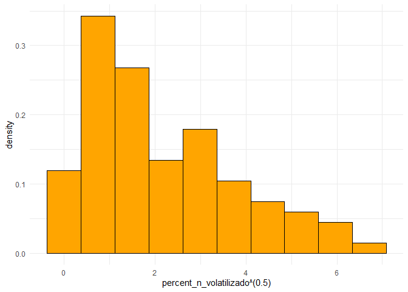
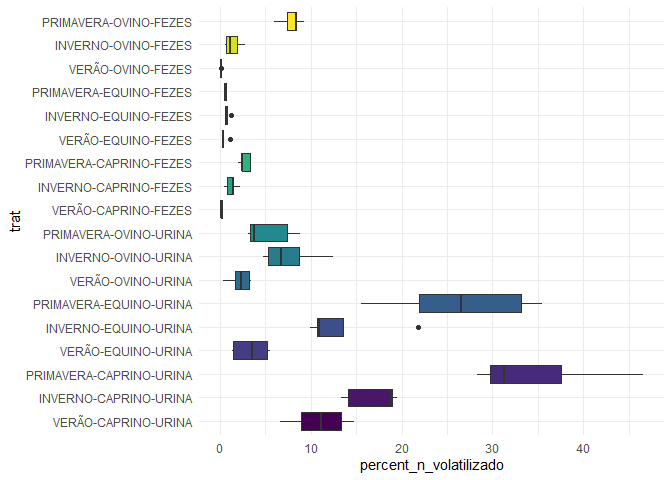

<!-- README.md is generated from README.Rmd. Please edit that file -->

# Análise de volatilização de amônia por excretas animal

## Carregando Pacotes

``` r
library(tidyverse)
library(ExpDes.pt)
library(emmeans)
library(readxl)
library(skimr)
library(MASS)
library(lme4)
```

## Entrada de dados

``` r
dados <- read_xlsx("data/DADOS GILMAR VOL NH3.xlsx") %>% 
  janitor::clean_names() %>% 
  mutate_at(vars(estacao, especie, excreta), as_factor)
glimpse(dados)
#> Rows: 90
#> Columns: 10
#> $ tratamento             <chr> "Urina de Caprino", "Urina de Caprino", "Urina ~
#> $ estacao                <fct> VERÃO, VERÃO, VERÃO, VERÃO, VERÃO, VERÃO, VERÃO~
#> $ especie                <fct> CAPRINO, CAPRINO, CAPRINO, CAPRINO, CAPRINO, EQ~
#> $ excreta                <fct> URINA, URINA, URINA, URINA, URINA, URINA, URINA~
#> $ tr                     <dbl> 2, 2, 2, 2, 2, 4, 4, 4, 4, 4, 6, 6, 6, 6, 6, 1,~
#> $ especie_2              <dbl> 1, 1, 1, 1, 1, 2, 2, 2, 2, 2, 3, 3, 3, 3, 3, 1,~
#> $ excreta_2              <dbl> 1, 1, 1, 1, 1, 1, 1, 1, 1, 1, 1, 1, 1, 1, 1, 2,~
#> $ estacao_2              <dbl> 1, 1, 1, 1, 1, 1, 1, 1, 1, 1, 1, 1, 1, 1, 1, 1,~
#> $ bloco                  <dbl> 1, 2, 3, 4, 5, 1, 2, 3, 4, 5, 1, 2, 3, 4, 5, 1,~
#> $ percent_n_volatilizado <dbl> 13.31456414, 14.72593502, 11.09723583, 6.643591~
```

## Resumo simples dos dados

``` r
skim(dados)
```

|                                                  |       |
|:-------------------------------------------------|:------|
| Name                                             | dados |
| Number of rows                                   | 90    |
| Number of columns                                | 10    |
| \_\_\_\_\_\_\_\_\_\_\_\_\_\_\_\_\_\_\_\_\_\_\_   |       |
| Column type frequency:                           |       |
| character                                        | 1     |
| factor                                           | 3     |
| numeric                                          | 6     |
| \_\_\_\_\_\_\_\_\_\_\_\_\_\_\_\_\_\_\_\_\_\_\_\_ |       |
| Group variables                                  | None  |

Data summary

**Variable type: character**

| skim_variable | n_missing | complete_rate | min | max | empty | n_unique | whitespace |
|:--------------|----------:|--------------:|----:|----:|------:|---------:|-----------:|
| tratamento    |         0 |             1 |  14 |  16 |     0 |        6 |          0 |

**Variable type: factor**

| skim_variable | n_missing | complete_rate | ordered | n_unique | top_counts                |
|:--------------|----------:|--------------:|:--------|---------:|:--------------------------|
| estacao       |         0 |             1 | FALSE   |        3 | VER: 30, INV: 30, PRI: 30 |
| especie       |         0 |             1 | FALSE   |        3 | CAP: 30, EQU: 30, OVI: 30 |
| excreta       |         0 |             1 | FALSE   |        2 | URI: 45, FEZ: 45          |

**Variable type: numeric**

| skim_variable           | n_missing | complete_rate | mean |    sd |   p0 |  p25 |  p50 |   p75 |  p100 | hist  |
|:------------------------|----------:|--------------:|-----:|------:|-----:|-----:|-----:|------:|------:|:------|
| tr                      |         0 |             1 | 3.50 |  1.72 | 1.00 | 2.00 | 3.50 |  5.00 |  6.00 | ▇▃▃▃▃ |
| especie_2               |         0 |             1 | 2.00 |  0.82 | 1.00 | 1.00 | 2.00 |  3.00 |  3.00 | ▇▁▇▁▇ |
| excreta_2               |         0 |             1 | 1.50 |  0.50 | 1.00 | 1.00 | 1.50 |  2.00 |  2.00 | ▇▁▁▁▇ |
| estacao_2               |         0 |             1 | 2.00 |  0.82 | 1.00 | 1.00 | 2.00 |  3.00 |  3.00 | ▇▁▇▁▇ |
| bloco                   |         0 |             1 | 3.00 |  1.42 | 1.00 | 2.00 | 3.00 |  4.00 |  5.00 | ▇▇▇▇▇ |
| percent_n\_volatilizado |         0 |             1 | 7.55 | 10.03 | 0.01 | 0.66 | 3.24 | 10.44 | 46.59 | ▇▁▁▁▁ |

## Explorando a variável resposta

``` r
dados %>% 
  ggplot(aes(x=percent_n_volatilizado, y = ..density..)) +
  geom_histogram(bins = 10, color="black", fill="aquamarine4")+
  theme_minimal()
```

<!-- -->

transformado

``` r
dados %>% 
  ggplot(aes(x=percent_n_volatilizado^(.5), y = ..density..)) +
  geom_histogram(bins = 10, color="black", fill="orange")+
  theme_minimal()
```

<!-- -->

``` r
dados %>% 
  ggplot(aes(x=log10(percent_n_volatilizado), y = ..density..)) +
  geom_histogram(bins = 10, color="black", fill="lightblue")+
  theme_minimal()
```

<!-- -->

## Testando os pressupostos

``` r
dados <- dados %>% 
  mutate(
    trat = interaction(estacao, especie, excreta,sep="-"))
```

## Anova Preliminar

``` r
mod0 <- aov(percent_n_volatilizado ~ trat, data =dados)
summary(mod0)
#>             Df Sum Sq Mean Sq F value Pr(>F)    
#> trat        17   8190   481.8   44.98 <2e-16 ***
#> Residuals   72    771    10.7                   
#> ---
#> Signif. codes:  0 '***' 0.001 '**' 0.01 '*' 0.05 '.' 0.1 ' ' 1

dados %>% 
  mutate(
    pred = predict(mod0),
    rs = rstudent(mod0)
  ) %>% 
  ggplot(aes(x=rs, y= ..density..)) +
  geom_histogram(bins = 10, color="black", fill="lightgray")+
  theme_minimal()
```

<!-- --> teste de
normalidade de **Shapiro-Wilk**

``` r
mod0 %>% rstudent() %>% shapiro.test()
#> 
#>  Shapiro-Wilk normality test
#> 
#> data:  .
#> W = 0.83627, p-value = 1.427e-08
```

``` r
dados %>% 
  ggplot(aes(x=trat, y= percent_n_volatilizado,fill=trat)) +
  geom_boxplot()+
  theme_minimal() +
  coord_flip() +
  theme(legend.position = "none") +
  scale_fill_viridis_d()
```

<!-- -->

> Existe uma discrepância nos valores de `percent_n_volatilizado` entre
> urina e fezes, levando a heterocedasticidade.

### Possiveis Soluções popostas:

-   1)  Padronizar os valores de `percent_n_volatilizado`

-   2)  Aplicar uma transformação nos dados para trazer todos a uma
        mesma escala.

-   3)  Realizar a análise independente da `excreta`, ou seja, uma
        análise para cada excreta.
